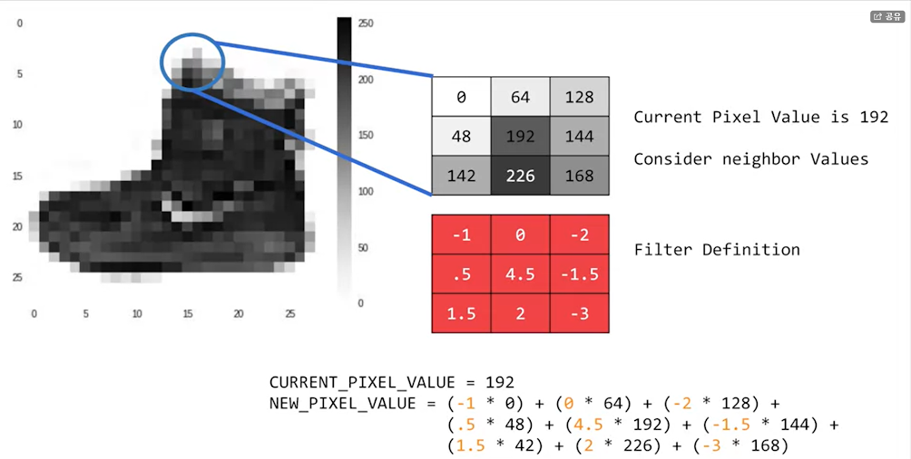

# WEEK 3 :Enhancing Vision with Convolutional Neural Networks
> 메인 주제는 convolution, 가방의 가방끈을 알아보도록하고, 신발의 굽(또는 신발 끈)을 알아보도록하는 기술
> It's a filter that you pass over an image in the same way as if you're doing sharpening(선명하게), if you've ever done image processing.

### convolution


회색이 이미지의 픽셀, 빨간색이 필터.
이들을 곱해 값을 만드는 것이 convolution
-> convolution는 이미지의 몇가지 특징이 강조 되도록 이미지를 변경 시킬수 있다.
ex) 수직이 강조 될수도, 수평이 강조 될 수도 있다.

### Pooling


-> Pooling이란 이미지 압축을 말한다.
-> convolution과 합해지면 더욱 강력해진다.
간단한 Pooling 방법 :  인접한 4개의 pixel을 중에 가장 두드러지는 값을 선택하는 것 (예를 들어 가장 큰값)


#### 코드 자료(Coding convolutions and pooling layers)

- [Conv2D](https://www.tensorflow.org/api_docs/python/tf/keras/layers/Conv2D) layers and [MaxPooling2D](https://www.tensorflow.org/api_docs/python/tf/keras/layers/MaxPool2D) layers in TensorFlow

#### Convolution 에 대해 더 알아보고 싶다면 [여기](https://bit.ly/2UGa7uH)로

```py
오리지널 코드
model = tf.keras.models.Sequential([
  tf.keras.layers.Flatten(),
  tf.keras.layers.Dense(128, activation=tf.nn.relu),
  tf.keras.layers.Dense(10, activation=tf.nn.softmax)
])
```

```py
Convolution 추가 코드
model = tf.keras.models.Sequential([
  tf.keras.layers.Conv2D(64, (3,3), activation='relu', input_shape=(28, 28, 1)), #코드 설명1  
  tf.keras.layers.MaxPooling2D(2, 2), # 코드 설명2
  tf.keras.layers.Conv2D(64, (3,3), activation='relu'),
  tf.keras.layers.MaxPooling2D(2,2),
  tf.keras.layers.Flatten(),
  tf.keras.layers.Dense(128, activation='relu'),
  tf.keras.layers.Dense(10, activation='softmax')
])

```

```
# 코드 설명1
We're asking keras to generate 64 filters for us. 
These filters are 3 by 3, their activation is relu, which means the negative values will be thrown way, 
and finally the input shape is as before, the 28 by 28. 
That extra 1 just means that we are tallying using a single byte for color depth.
As we saw before our image is our gray scale, so we just use one byte.

# 코드 설명2
최대값을 갖는 Pooling, 2by2 -> 4개의 픽셀 중에 가장 큰 것을 취한다.

-> 코드가 반복되면서 훨씬 적은 양을 갖게 된다.

```

### losing poxel margi
> pooling을 하게 되면 필터의 크기에 따라 겉의 픽셀들을 사용할 수 없게 된다.

